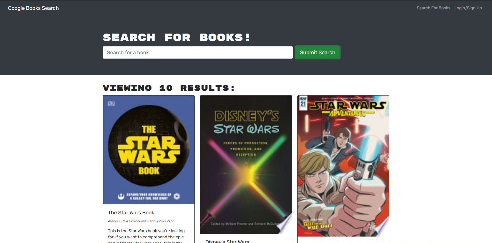

# book-search

## Description
Google's book search app refactored to use graphql and apollo server. To view the live site on heroku, click [here](https://sb-book-search.herokuapp.com/)
## Table of Contents
* [Installation](#Installation)
* [Usage](#Usage)
* [License](#License)
* [Contributing](#Contributing)
* [Tests](#Tests)
* [Questions](#Questions)
## Installation
N/A
## Usage
N/A
## License
This project is covered under the GNU GPLv3 license.
## Contributing
N/A
## Tests
N/A
## Questions
GitHub: [github.com/stephenbeiter](http://github.com/stephenbeiter)  
Email: [stephenbeiter@gmail.com](mailto:stephenbeiter@gmail.com)
## Created by
### Stephen Beiter
